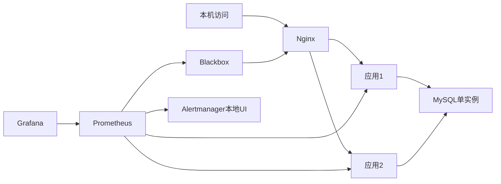

# 云应用部署、可观测性与恢复实验

实现：Nginx反向代理、两个Python/Gunicorn实例、MySQL、Prometheus、Grafana、Alertmanager、Blackbox Exporter；Linux VM可选Node Exporter。当前本地仅验证Python应用及SQLite模式，Docker、MySQL、告警和宿主机采集尚待实跑。镜像标签为固定版本起点，部分标签仍可变；不是已审计安全基线或性能承诺。

## A. 不装Docker也能验证的部分

在仓库根目录，用Python 3.11或以上：

```sh
python cloud/app.py
```

浏览器打开 http://127.0.0.1:8081/api/status 。显示synthetic以及3条模拟资产，使用SQLite；停止用Ctrl+C。这仅验证应用逻辑，不能算完成Linux部署或MySQL实验。

## B. 完整Docker实验

Linux虚拟机或Windows Docker Desktop的Linux容器模式；建议为环境分配4核/6GB，实际占用待测。Python 3.11+，Docker Engine与Compose v2，首次构建需要拉取镜像。

```sh
cd cloud
python scripts/init_env.py
docker compose config --quiet
docker compose up -d --build --wait --wait-timeout 240
docker compose ps
docker compose exec nginx nginx -t
docker compose exec prometheus promtool check config /etc/prometheus/prometheus.yml
docker compose exec prometheus promtool check rules /etc/prometheus/alerts.yml
```

访问：应用 http://127.0.0.1:8080/api/status；Grafana http://127.0.0.1:3000；Prometheus http://127.0.0.1:9090；Alertmanager http://127.0.0.1:9093。
Grafana账号labadmin，密码见本地.env的GRAFANA_PASSWORD。该文件被Git忽略。随机密码第一次生成后不会被脚本覆盖；已有MySQL数据卷不会随.env修改而改密码。

应用只读，无业务写入与用户鉴权功能；示例不开放公网，端口映射只绑定127.0.0.1。数据库未映射宿主机端口。监控默认仅在本机显示告警，未接入邮件或短信。

## C. Linux主机指标扩展

仅在Linux VM执行：

```sh
docker compose -f compose.yaml -f compose.host.yaml up -d --build --wait
```

此命令将Linux根目录只读映射给Node Exporter以采集主机CPU、内存、磁盘；Docker Desktop运行时看到的通常是其Linux VM，不能称为Windows宿主机监控。默认部署不采集容器CPU/内存，没有cAdvisor。扩展添加node job，默认部署的Host类规则因没有样本不会触发。

## D. 四类故障与验收

| 案例 | 故障注入（仅本实验） | 证据 | 恢复与验收 |
|---|---|---|---|
| C01单应用停止 | docker compose stop app1 | AppInstanceDown；反复请求业务，保存代理upstream日志 | docker compose start app1；两目标up=1、业务成功 |
| C02数据库停止 | docker compose stop db | healthz仍200；readyz为503；lab_db_up=0；业务探针失败 | docker compose start db；查询恢复、告警解除 |
| C03入口停止 | docker compose stop nginx | app up可仍为1，但BusinessProbeFailed | docker compose start nginx；经代理的readyz恢复 |
| C04备份恢复校验 | python scripts/backup.py | SQL文件、大小、SHA256、restore_verified=false | 执行restore_check.py，恢复到新库并比较全部模拟记录 |

每次只注入一个故障；记录UTC时刻、5秒采样间隔、15秒for、Alertmanager的5秒group_wait。实际通知延迟还受采样相位、查询与评估耗时影响；不能承诺“15秒必达”。先完成基线，再记录首次失败、首次告警、恢复动作、持续恢复和告警解除时间；报告原始日志及至少3次重复结果。

```sh
python scripts/backup.py
python scripts/restore_check.py backups/lab-实际时间.sql
```

恢复脚本只接受本脚本备份目录内文件，验证哈希后创建新的restore_时间戳库，不覆盖原lab库。恢复库保留用于检查。备份是单次逻辑快照，无binlog归档；RPO取决于备份间隔，RTO必须从实际演练计时。只看到SQL文件不算恢复通过。

CPU/内存/磁盘告警已给规则，但未提供填满宿主机磁盘的脚本；后续使用单独小容量实验文件系统或规则测试数据验证。不要将尚未执行的资源故障写成项目实绩。

## 设计选择与边界

- /healthz仅证明进程在响应；/readyz会真实查询数据库；/metrics查询失败时仍返回200，并用lab_db_up=0表达依赖失败，保留观测通道。
- Nginx是被动失败重试；Blackbox周期主动探测业务。Docker healthcheck标记健康状态，不会自动把unhealthy容器重启。
- Nginx使用Docker DNS动态解析容器地址；应用重建换IP无需依赖旧解析结果。恢复后仍应重新测试。
- 两个应用实例共享一个MySQL，并在同一宿主机；Nginx、DB和宿主机都是单点。不能描述成多机房容灾、数据库高可用或99.99%可用。
- 每实例1个Gunicorn worker、4线程，指标是进程内计数器；重启会清零，用rate处理计数器重置。增加多worker前需要共享/多进程指标方案。
- 健康检测和只读API使用短连接，避免演示引入连接池失效处理；生产负载下需要连接池、容量评估与压测。
- 日志通过Docker json-file进行10MB×3轮转；没有定时删除任意目录的清理操作。
- 备份可能包含业务数据，应留在本地或受控存储，默认不会上传GitHub。本例仅使用模拟数据。


