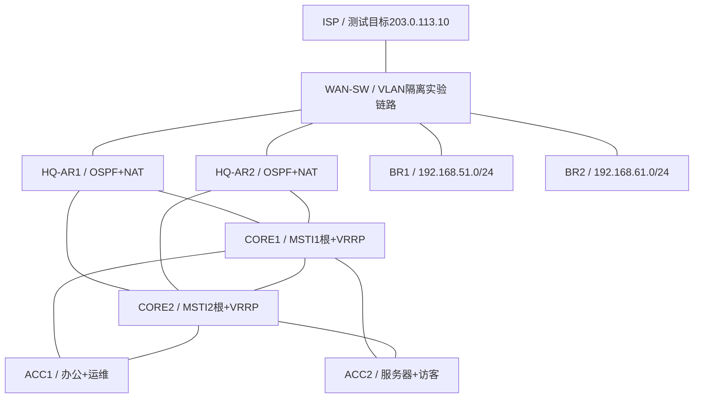

# 网络逻辑拓扑

此图表达逻辑链路；实际物理连线必须使用README接线表。

```mermaid
flowchart TB
 ISP[ISP / 测试目标203.0.113.10]
 WAN[WAN-SW / VLAN隔离实验链路]
 AR1[HQ-AR1 / OSPF+NAT]
 AR2[HQ-AR2 / OSPF+NAT]
 C1[CORE1 / MSTI1根+VRRP]
 C2[CORE2 / MSTI2根+VRRP]
 A1[ACC1 / 办公+运维]
 A2[ACC2 / 服务器+访客]
 B1[BR1 / 192.168.51.0/24]
 B2[BR2 / 192.168.61.0/24]
 ISP --- WAN
 WAN --- AR1
 WAN --- AR2
 WAN --- B1
 WAN --- B2
 AR1 --- C1
 AR1 --- C2
 AR2 --- C1
 AR2 --- C2
 C1 --- C2
 C1 --- A1
 C2 --- A1
 C1 --- A2
 C2 --- A2
```

